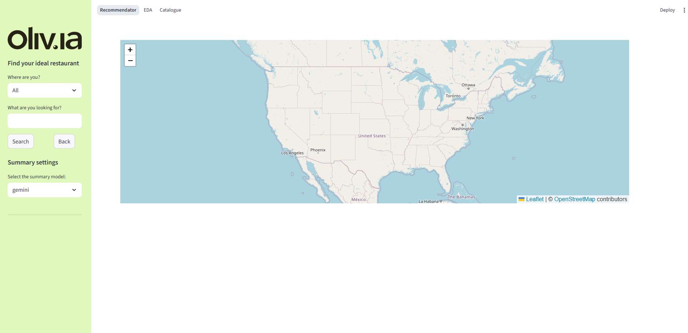
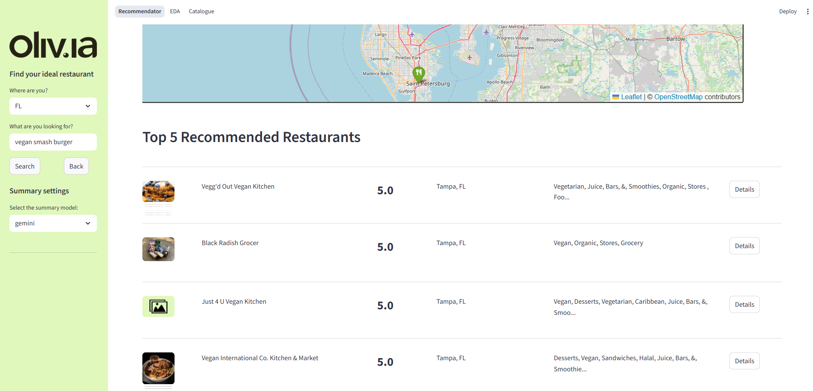
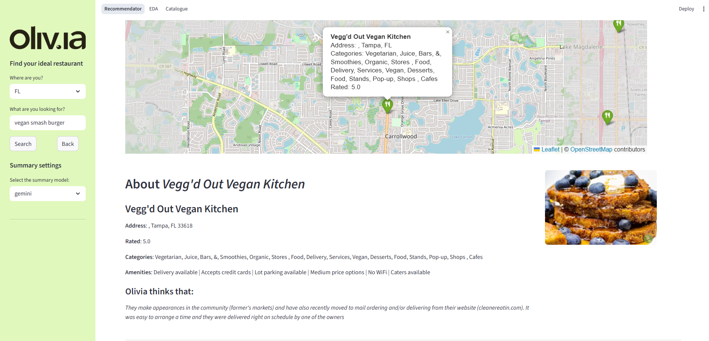
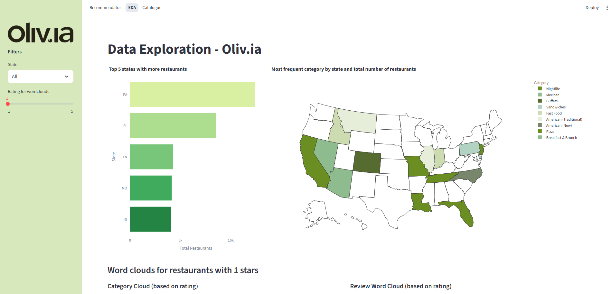
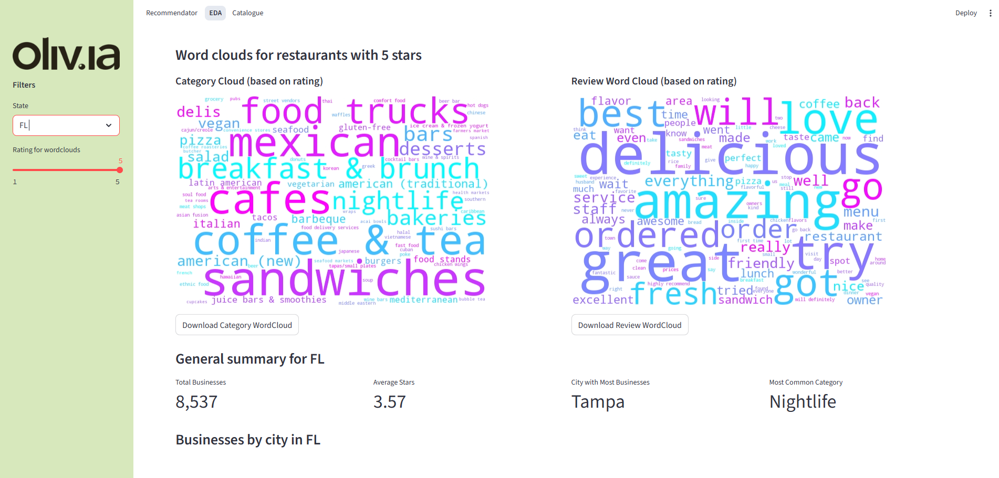
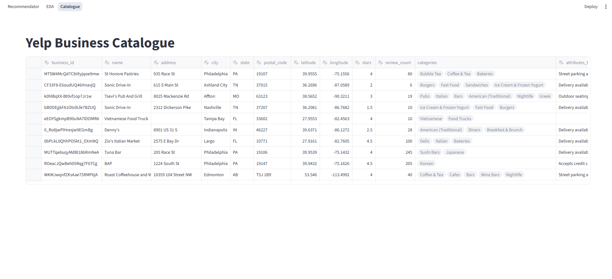

# Oliv.ia - Restaurant Recommendation System


## Overview

Oliv.ia is an interactive web application built with Streamlit that combines Exploratory Data Analysis (EDA) of the Yelp restaurant dataset with a recommendation system powered by Natural Language Processing (NLP). The app allows users to explore restaurant data visually and receive personalized restaurant recommendations based on descriptions and reviews.

## Datasets

- Yelp business data (`.parquet` format)
- Attributes data (multi-hot encoded)
- Word cloud images (pre-generated)
- Embeddings and review summaries (used by the recommendation engine)
- **Yelp photo dataset** (optional, for future image-based enhancements)

> **Note:** Due to dataset size and privacy, the Yelp dataset is not included in this repository.

## Features

### Recommendation System

- Custom search by free text and state filters.
- Recommendations based on restaurant descriptions and reviews using NLP.
- Automatic summarization of reviews for each recommended restaurant (using different summarization models: Gemini, BART, Sumy).
- Map visualization with marker clustering.
- Detailed view of each restaurant including address, rating, categories, and amenities.
- Top 5 recommended restaurants list with a button to see details.

### Exploratory Data Analysis (EDA)

- Interactive map showing restaurant locations by US state.
- Visual analysis of top categories, cities, and attributes.
- Word clouds based on restaurant reviews and categories.
- Distribution of ratings by city and state.
- Data filtering by state and rating.


## Screenshots
### Recommendator




### EDA



### Catalogue



## Installation

### 1. Clone this repository:

```bash
git clone https://github.com/your-username/olivia.git
cd olivia
```

### 2. Create a virtual environment:

```bash
python -m venv venv
source venv/bin/activate      # On macOS/Linux
venv\Scripts\activate       # On Windows
```

### 3. Install dependencies:

```bash
pip install -r requirements.txt
```

### 4. Configure environment variables (if needed):

If you're using APIs like Google Generative AI or Hugging Face, create a `.env` file with your keys:

```bash
GOOGLE_API_KEY=your_key_here
```

---

## Run the app:

```bash
streamlit run app.py
```

The app will open automatically in your default web browser.

---
## Notebooks

The project includes a `notebooks/` folder containing the detailed development of all pipeline phases. The recommended execution order is as follows:

| Nº  | Notebook                                 | Description                                                                 |
|-----|------------------------------------------|-----------------------------------------------------------------------------|
| 01  | `01_preprocessing.ipynb`                 | Initial preprocessing of the base datasets (Yelp business and reviews). Cleaning, transformation, and data merging. |
| 02  | `02_eda.ipynb`                           | Exploratory Data Analysis (EDA): visualizations, maps, category and rating distributions, word clouds, etc. |
| 03  | `03_Feature_extraction.ipynb`            | Feature extraction from textual and semantic content. Embedding generation and text processing. |
| 04  | `04_yelp_testing_inputs.csv`             | Input file with example queries for testing the recommendation system.     |
| 05  | `04_yelp_validation_input_testing.ipynb` | Manual evaluation of the system using natural language queries. Comparison between results and expectations. |
| 06  | `05_yelp_validation_preprocessing.ipynb` | Data preparation for system validation.                                     |
| 07  | `06_yelp_validation_training.ipynb`      | Training simulation: embedding organization and internal validation.        |
| 08  | `07_yelp_validation_testing.ipynb`       | Evaluation and visualization of the recommender's performance in different scenarios. |

> ⚠️ **Note**: All notebooks assume that the `datasets/` folder is located at the same level as `notebooks/` in the project structure.

## Project Structure

```
olivia/
├── app.py                # Main Streamlit app
├── pages/                # Sub-pages (EDA, Recommender, etc.)
├── datasets/             # Dataset files (not included in repo)
├── img/                  # Images, logos, wordclouds, screenshots
├── models/               # (Optional) Saved models or embeddings
├── notebooks/            # Jupyter Notebooks for preprocessing, EDA, feature extraction, and validation
├── README.md             # Documentation
├── requirements.txt      # Python dependencies
├── .gitignore            # Git ignore file
└── ...
```

##  Requirements

Main libraries used:

- streamlit
- pandas
- plotly
- numpy
- pillow
- streamlit-folium
- folium
- sentence-transformers
- langchain
- langchain-google-genai
- transformers
- sumy
- python-dotenv

> See `requirements.txt` for the complete list.

---

## Recommendation System

The recommender uses a combination of:

- **Sentence embeddings** (`sentence-transformers`)
- **Summarization techniques** (`sumy`, `transformers`)
- **LLM support (optional)** through **Google Generative AI** or similar APIs.

---

## To-Do

- [ ] Improve recommendation explanations.
- [ ] Deploy the app (e.g., Streamlit Cloud, HuggingFace Spaces).
- [ ] Add user feedback form.

---

## Author

Made with ❤️ by DeepWinner 
Santiago Arranz Orlandi,
Antonio Búa Pita,
Lucía García González

---

## License

This project is for educational and research purposes, and uses data provided under the **[Yelp Dataset Terms of Use](https://www.yelp.com/dataset)**.

---
