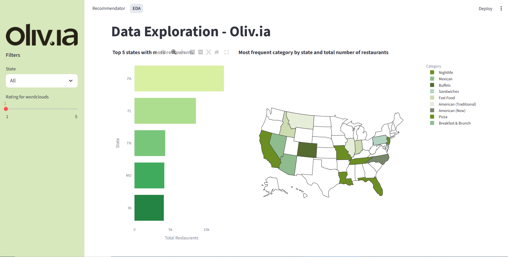
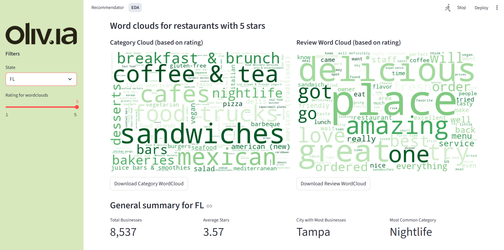
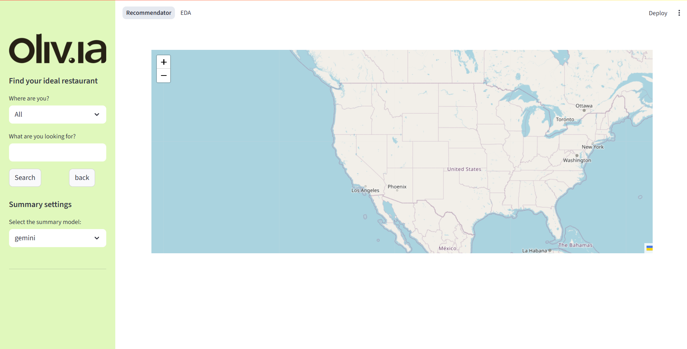
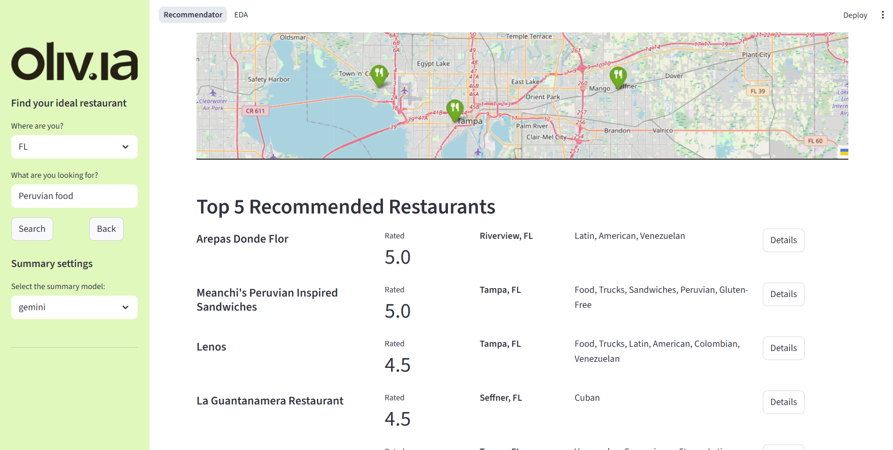
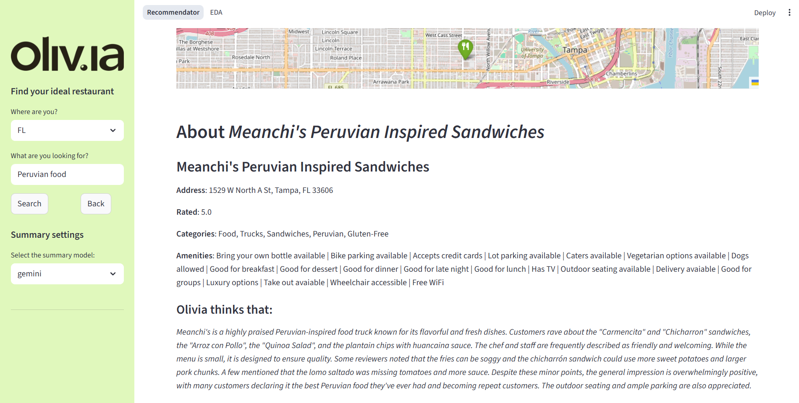

# Oliv.ia - Restaurant Recommendation System

## Overview

Oliv.ia is an interactive web application built with Streamlit that combines Exploratory Data Analysis (EDA) of the Yelp restaurant dataset with a recommendation system powered by Natural Language Processing (NLP). The app allows users to explore restaurant data visually and receive personalized restaurant recommendations based on descriptions and reviews.

## Datasets

- Yelp business data (`.parquet` format)
- Attributes data (multi-hot encoded)
- Word cloud images (pre-generated)
- Embeddings and review summaries (used by the recommendation engine)
- **Yelp photo dataset** (optional, for future image-based enhancements)

> **Note:** Due to dataset size and privacy, the Yelp dataset is not included in this repository.

## Features

### Exploratory Data Analysis (EDA)

- Interactive map showing restaurant locations by US state.
- Visual analysis of top categories, cities, and attributes.
- Word clouds based on restaurant reviews and categories.
- Distribution of ratings by city and state.
- Data filtering by state and rating.

### Recommendation System

- Custom search by free text and state filters.
- Recommendations based on restaurant descriptions and reviews using NLP.
- Automatic summarization of reviews for each recommended restaurant (using different summarization models: Gemini, BART, Sumy).
- Map visualization with marker clustering.
- Detailed view of each restaurant including address, rating, categories, and amenities.
- Top 5 recommended restaurants list with a button to see details.

## Screenshots
### EDA



### Model




## Installation

### 1. Clone this repository:

```bash
git clone https://github.com/your-username/olivia.git
cd olivia
```

### 2. Create a virtual environment:

```bash
python -m venv venv
source venv/bin/activate      # On macOS/Linux
venv\Scripts\activate       # On Windows
```

### 3. Install dependencies:

```bash
pip install -r requirements.txt
```

### 4. Configure environment variables (if needed):

If you're using APIs like Google Generative AI or Hugging Face, create a `.env` file with your keys:

```bash
GOOGLE_API_KEY=your_key_here
```

---

## Run the app:

```bash
streamlit run app.py
```

The app will open automatically in your default web browser.

---
## Notebooks

The `/notebooks` folder includes all the development notebooks used during the project:

- **01_preprocessing.ipynb**: Data cleaning and format standardization.
- **02_eda.ipynb**: Exploratory Data Analysis with visual insights.
- **03_feature_extraction.ipynb**: Extraction of textual and categorical features.
- **04_validation.ipynb**: Evaluation and testing of the recommendation system.

These notebooks document the full development workflow of the application.

> ⚠️ **Important:** The `datasets/` folder must be located at the root level of the project (alongside `app.py` and `notebooks/`), not inside the `notebooks/` folder.  
> Otherwise, the notebooks and the app will not be able to correctly locate the data files.

## Project Structure

```
olivia/
├── app.py                # Main Streamlit app
├── pages/                # Sub-pages (EDA, Recommender, etc.)
├── datasets/             # Dataset files (not included in repo)
├── img/                  # Images, logos, wordclouds, screenshots
├── models/               # (Optional) Saved models or embeddings
├── README.md             # Documentation
├── requirements.txt      # Python dependencies
├── .gitignore            # Git ignore file
└── ...
```

---

##  Requirements

Main libraries used:

- streamlit
- pandas
- plotly
- numpy
- pillow
- streamlit-folium
- folium
- sentence-transformers
- langchain
- langchain-google-genai
- transformers
- sumy
- python-dotenv

> See `requirements.txt` for the complete list.

---

## Recommendation System

The recommender uses a combination of:

- **Sentence embeddings** (`sentence-transformers`)
- **Summarization techniques** (`sumy`, `transformers`)
- **LLM support (optional)** through **Google Generative AI** or similar APIs.

---

## To-Do

- [ ] Improve recommendation explanations.
- [ ] Deploy the app (e.g., Streamlit Cloud, HuggingFace Spaces).
- [ ] Add user feedback form.

---

## 💻 Author

Made with ❤️ by DeepWinner 
Santiago Arranz Orlandi,
Antonio Búa Pita,
Lucía García González

---

## 📜 License

This project is for educational and research purposes, and uses data provided under the **[Yelp Dataset Terms of Use](https://www.yelp.com/dataset)**.

---
